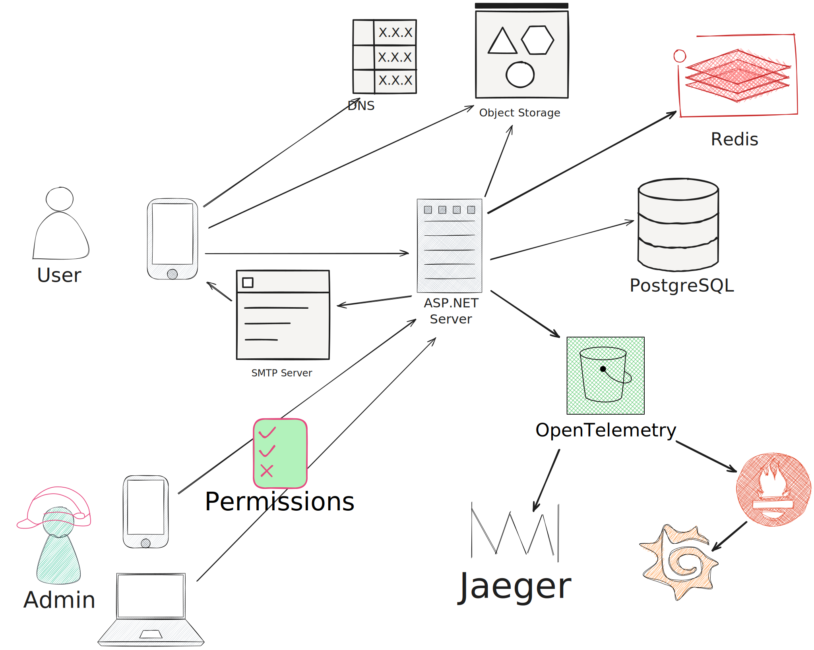

# Описание архитектуры

## Архитектурная диаграмма проекта

## Сервисы Docker Compose
### 1. prod
**prod** - основной сервис бекенда. Это HTTP-сервер на базе ASP.NET Core, реализующий бизнес-логику проекта. Сервис зависит от **postgres** и **redis** для хранения
данных.

### 2. postgres
**postgres** - сервис базы данных, запускающий СУБД PostgreSQL. На сервисе хранятся все структурированные данные проекта. Не зависит от других сервисов.
### 3. redis
**redis** - сервис K/V хранилища на базе Redis. Сервис хранит временные данные, с помощью которых работает фича со сканированием QR-кодов. Не зависит от других сервисов.

### 4. prometheus
**prometheus** - сервис для сбора метрик с бекенда (сервиса **prod**). Зависит от сервиса **prod** для работы, но не требует предварительного запуска.

### 5. grafana
**grafana** - сервис, предоставляющий UI для визуализации метрик, собранных **prometheus** и **jaeger**.

### 6. jaeger
**jaeger** - сервис, отслеживающий tracing-информацию с бекенда. Зависит от **loki**, откуда берет логи.

### 7. elasticsearch
**elasticsearch** - сервис, индексирующий и хранящий диагностическую информацию из **jaeger**.

### 8. loki
**loki** - сервис для сбора логов с других сервисов.
