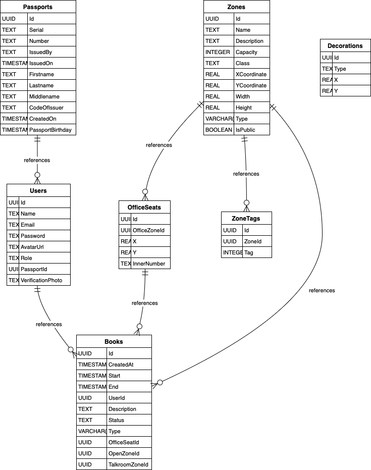

# Untitled Diagram documentation
## Summary

- [Introduction](#introduction)
- [Database Type](#database-type)
- [Table Structure](#table-structure)
    - [Decorations](#Decorations)
    - [Passports](#Passports)
    - [Zones](#Zones)
    - [Users](#Users)
    - [OfficeSeats](#OfficeSeats)
    - [ZoneTags](#ZoneTags)
    - [Books](#Books)
- [Relationships](#relationships)
- [Database Diagram](#database-Diagram)

## Introduction

## Database type

- **Database system:** PostgreSQL
## Table structure

### Decorations

| Name        | Type          | Settings                      | References                    | Note                           |
|-------------|---------------|-------------------------------|-------------------------------|--------------------------------|
| **Id** | UUID | 🔑 PK, not null , unique |  | |
| **Type** | TEXT | not null  |  | |
| **X** | REAL | not null  |  | |
| **Y** | REAL | not null  |  | | 

### Passports

| Name        | Type          | Settings                      | References                    | Note                           |
|-------------|---------------|-------------------------------|-------------------------------|--------------------------------|
| **Id** | UUID | 🔑 PK, not null , unique | fk_Passports_Id_Users | |
| **Serial** | TEXT | not null  |  | |
| **Number** | TEXT | not null  |  | |
| **IssuedBy** | TEXT | not null  |  | |
| **IssuedOn** | TIMESTAMP | not null  |  | |
| **Firstname** | TEXT | not null  |  | |
| **Lastname** | TEXT | not null  |  | |
| **Middlename** | TEXT | not null  |  | |
| **CodeOfIssuer** | TEXT | not null  |  | |
| **CreatedOn** | TIMESTAMP | not null  |  | |
| **PassportBirthday** | TIMESTAMP | not null  |  | | 

### Zones

| Name        | Type          | Settings                      | References                    | Note                           |
|-------------|---------------|-------------------------------|-------------------------------|--------------------------------|
| **Id** | UUID | 🔑 PK, not null , unique | fk_Zones_Id_OfficeSeats,fk_Zones_Id_ZoneTags,fk_Zones_Id_Books,fk_Zones_Id_Books | |
| **Name** | TEXT | not null  |  | |
| **Description** | TEXT | not null  |  | |
| **Capacity** | INTEGER | not null  |  | |
| **Class** | TEXT | not null  |  | |
| **XCoordinate** | REAL | not null  |  | |
| **YCoordinate** | REAL | not null  |  | |
| **Width** | REAL | not null  |  | |
| **Height** | REAL | not null  |  | |
| **Type** | VARCHAR(8) | not null  |  | |
| **IsPublic** | BOOLEAN | not null  |  | | 

### Users

| Name        | Type          | Settings                      | References                    | Note                           |
|-------------|---------------|-------------------------------|-------------------------------|--------------------------------|
| **Id** | UUID | 🔑 PK, not null , unique | fk_Users_Id_Books | |
| **Name** | TEXT | not null  |  | |
| **Email** | TEXT | not null  |  | |
| **Password** | TEXT | not null  |  | |
| **AvatarUrl** | TEXT | not null  |  | |
| **Role** | TEXT | not null  |  | |
| **PassportId** | UUID | not null  |  | |
| **VerificationPhoto** | TEXT | not null  |  | | 

#### Indexes
| Name | Unique | Fields |
|------|--------|--------|
| IX_Users_Email | ✅ | Email |
| IX_Users_PassportId |  | PassportId |
### OfficeSeats

| Name        | Type          | Settings                      | References                    | Note                           |
|-------------|---------------|-------------------------------|-------------------------------|--------------------------------|
| **Id** | UUID | 🔑 PK, not null , unique | fk_OfficeSeats_Id_Books | |
| **OfficeZoneId** | UUID | not null  |  | |
| **X** | REAL | not null  |  | |
| **Y** | REAL | not null  |  | |
| **InnerNumber** | TEXT | not null  |  | | 

#### Indexes
| Name | Unique | Fields |
|------|--------|--------|
| IX_OfficeSeats_OfficeZoneId |  | OfficeZoneId |
### ZoneTags

| Name        | Type          | Settings                      |
|-------------|---------------|-------------------------------|
| **Id** | UUID | 🔑 PK, not null , unique |
| **ZoneId** | UUID | not null  |
| **Tag** | INTEGER | not null  | 

#### Indexes
| Name | Unique | Fields |
|------|--------|--------|
| IX_ZoneTags_ZoneId |  | ZoneId |
### Books

| Name        | Type          | Settings                      |
|-------------|---------------|-------------------------------|
| **Id** | UUID | 🔑 PK, not null , unique |
| **CreatedAt** | TIMESTAMP | not null  |
| **Start** | TIMESTAMP | not null  |
| **End** | TIMESTAMP | not null  |
| **UserId** | UUID | not null  |
| **Description** | TEXT | not null  |
| **Status** | TEXT | not null  |
| **Type** | VARCHAR(8) | not null  |
| **OfficeSeatId** | UUID | not null  |
| **OpenZoneId** | UUID | not null  |
| **TalkroomZoneId** | UUID | not null  | 

#### Indexes
| Name | Unique | Fields |
|------|--------|--------|
| IX_Books_OfficeSeatId |  | OfficeSeatId |
| IX_Books_OpenZoneId |  | OpenZoneId |
| IX_Books_TalkroomZoneId |  | TalkroomZoneId |
| IX_Books_UserId |  | UserId |
## Relationships

- **Passports to Users**: one_to_many
- **Zones to OfficeSeats**: one_to_many
- **Zones to ZoneTags**: one_to_many
- **OfficeSeats to Books**: one_to_many
- **Users to Books**: one_to_many
- **Zones to Books**: one_to_many
- **Zones to Books**: one_to_many

## Database Diagram

### Simple

### Not Simple

